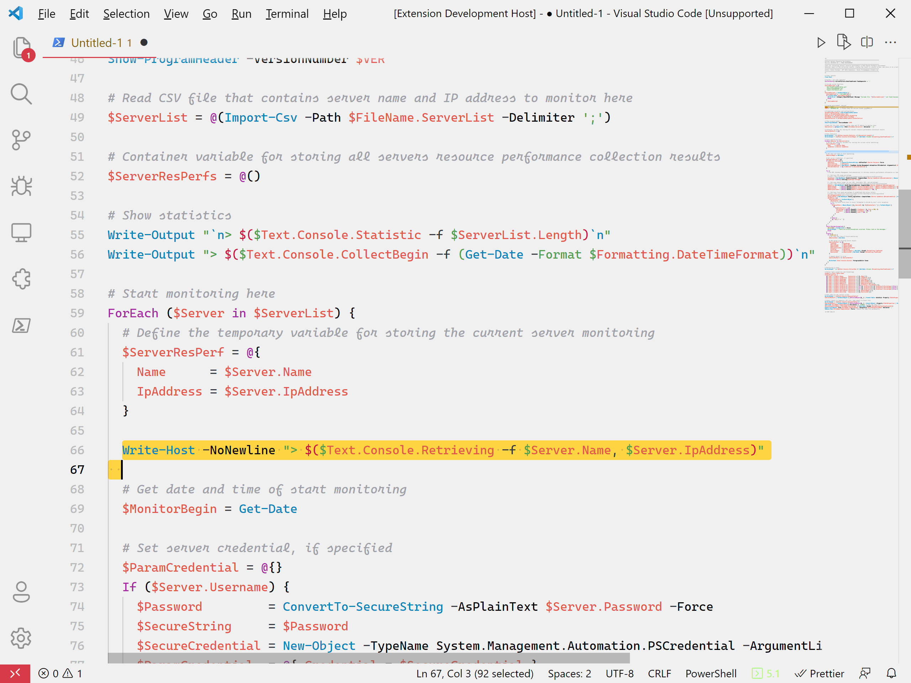

# Atom One X Github - Light Gray Theme

Combination of two popular light themes.

Credits to [vscode-theme-github-light](https://github.com/yunlingz/vscode-theme-github-light) for base color theme and [vscode-theme-onelight](https://github.com/akamud/vscode-theme-onelight) for token/syntax color theme.


[](https://github.com/softtama/atom-one-x-github---light-gray/stargazers)

* [GitHub repository](https://github.com/softtama/atom-one-x-github---light-gray.git)
* [Visual Studio Code marketplace](https://marketplace.visualstudio.com/items?itemName=softtama.atom-one-x-github---light-gray)

## Preview



## Tips

Use Cascadia Code font family and set tab size to 2 to experience the theme better.

```json
{
  "editor.fontLigatures": true,
  "editor.fontFamily": "Cascadia Code",
  "editor.tabSize": 2,
}
```

## License

[MIT License](LICENSE-MIT)